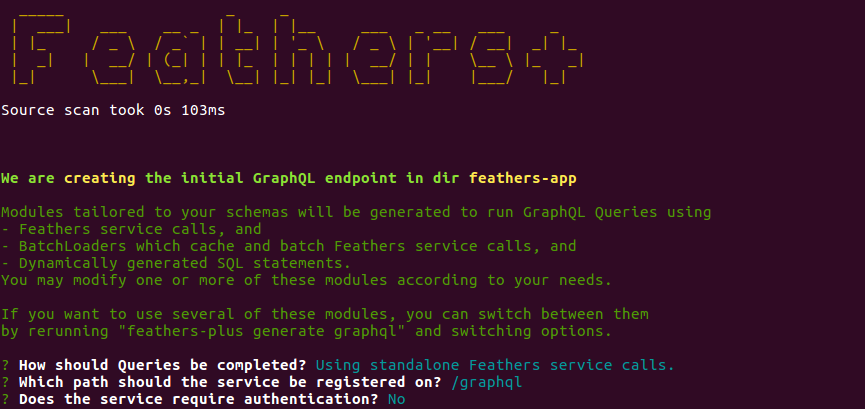

# @feathers-plus/graphql

> __This module is no longer maintained__

A high performance GraphQL adapter for SQL and non-SQL databases.

## Configuring the adapter

You can configure Feathers services using the @feathers-plus/graphql adapter as shown in the
[docs](https://generator.feathers-plus.com/api/#graphql).
The adapter can be configured to use either
- normal Feathers services,
- Feathers services with [BatchLoaders](https://feathers-plus.github.io/v1/batch-loader/), or
- raw SQL statements.

Press the appropriate `Show` button in the docs to see the relevant code.

## Examples

As you can see,
the adapter requires multiple working parts in order to configure the GraphQL instance properly.
That's just how GraphQL is.

[@feathers-plus/cli-generate-example](https://github.com/feathers-plus/cli-generator-example)
contains 10 working examples of using the GraphQL adapter.
They all use the same [database and  test harness](https://generator.feathers-plus.com/get-started/#comprehensive-example).
You should refer to them while reading the [docs](https://generator.feathers-plus.com/).

The examples are:

folder name | language | database | resolver functions
:-|:-|:-|:-|
js-nedb-services | JavaScript | NeDB | plain Feathers calls
js-nedb-batchloaders | JavaScript | NeDB | BatchLoader calls
js-sequelize-services | JavaScript | Sequelize + SQLite | plain Feathers calls
js-sequelize-batchloaders | JavaScript | Sequelize + SQLite | BatchLoader calls
js-sequelize-sql | JavaScript | Sequelize + SQLite | raw SQL statements
ts-nedb-services | TypeScript | NeDB | plain Feathers calls
ts-nedb-batchloaders | TypeScript | NeDB | BatchLoader calls
ts-sequelize-services | TypeScript | Sequelize + SQLite | plain Feathers calls
ts-sequelize-batchloaders | TypeScript | Sequelize + SQLite | BatchLoader calls
ts-sequelize-sql | TypeScript | Sequelize + SQLite | raw SQL statements

## Resolver Functions

GraphQL is a wrapper around [resolver functions](https://graphql.org/learn/execution/#root-fields-resolvers)
you have to provide.
You'll be familiar with resolvers if you've used the [fastJoin](https://feathers-plus.github.io/v1/feathers-hooks-common/guide.html#fastJoin)
common hook, as fastJoin's design is based on GraphQL.

You will find that you need to write **lots** of resolver functions for a non-trivial app.
For some insight, look at this
[relatively simple example](https://github.com/feathers-plus/cli-generator-example/blob/master/js-nedb-services/src/services/graphql/service.resolvers.js)
involving just 5 tables.

> Most of the effort in using GraphQL will be devoted to writing lots of resolver functions.

The above example uses normal Feathers service calls, without caching, without batching.
You would see an approximate ten-fold performance improvement is you used Feathers service calls
in conjunction with [BatchLoaders](https://feathers-plus.github.io/v1/batch-loader/).
These types of resolver functions would be
[more complicated.](https://github.com/feathers-plus/cli-generator-example/blob/master/js-nedb-services/src/services/graphql/batchloader.resolvers.js) 

Finally, you may consider resolver functions which produce raw SQL statements
if you are using an SQL database with Sequelize or Knex.
This may very well result in a performance improvement over BatchLoaders
but you would have to use something like [join-monster](https://join-monster.readthedocs.io/en/latest/)
along with resolver functions.

## Generating Resolver Functions

[@feathers-plus/cli](https://generator.feathers-plus.com/), a.k.a. cli+, was written to automatically generate
the resolver functions for you.
You can customize the resulting resolver code if necessary.

The examples in [@feathers-plus/cli-generate-example](https://github.com/feathers-plus/cli-generator-example)
were all written with cli+
and you can use cli+ to modify them.

## REST and GraphQL

REST and GraphQL are totally different. Each is dope *if used for the right thing.*

FeathersJS, using cli+, now supports both REST and GraphQL architectural concepts and their query languages.

## License

Copyright (c) 2018

Licensed under the [MIT license](LICENSE).
